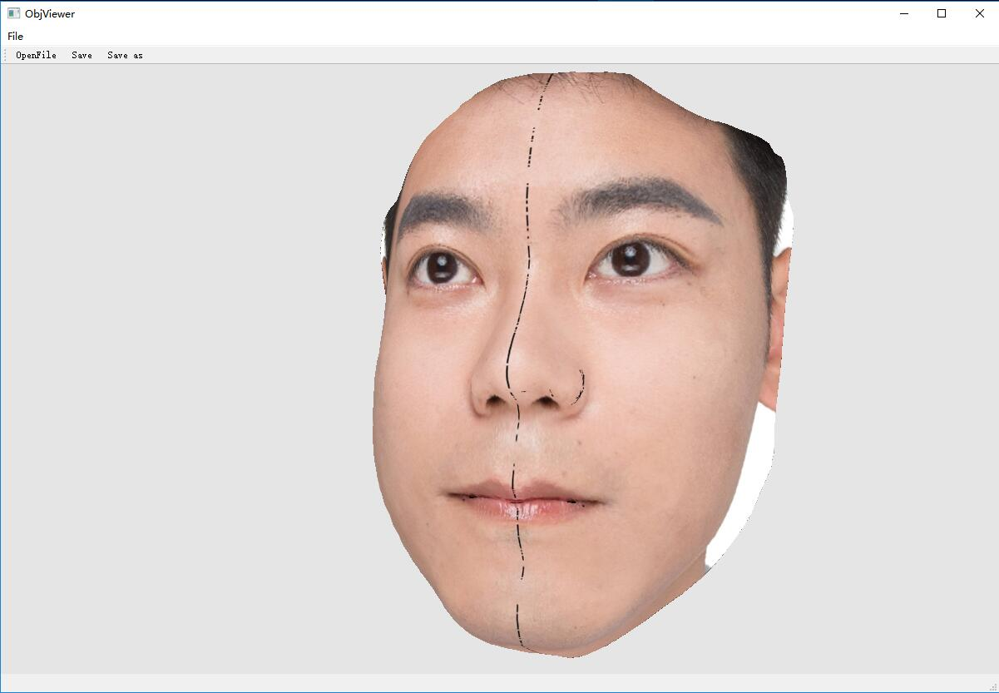

# 工程简介
因为一些原因，需要学习`Qt + openGL`，而使用`Qt`时，不建议直接引用`OpenGL`的源码头文件，这会影响到跨平台特性啥的。因此本工程的目的是通过实现一个简单的`*.obj`模型浏览器来学习Qt自己的OpenGL渲染。

我尽量少的引用外部的库，这样可以减轻其他人再使用的难度，但碰到不得已的情况，我也没办法。

## 环境
```
Qt:   Qt 5.8 msvc2015 x86
System:  windows 10 x64
Assimp-3.3
```

## Assimp
这是一个开源的图形库，支持多种格式的三维模型的读取和写出（读取支持的多，写出支持的少），所以我想用它来支持读取一些格式的三维模型。
请大家自行配置这个库，并在 `.pro`文件中修改路径地址。

## 工程完成进度问题
Mesh 就是简单的封装了下，包含了模型的点、UVCoord，贴图。模型绘制的时候使用的是face * 3的点的数量来绘制的，而没有使用Indices进行制作。并且没有实现光照，所以材质理论上是Basic材质。总之写得满糟糕的，刚入手QOpenGL系统的话可以看看。

## 额
虽然现在没写完，但已经达到我想要的效果了，暂时先不写了。以后有空再重写一个好一点的浏览框架吧。


## 不中用的笔记
1. [description of QtOpenGL](doc/description of qtOpenGL.md)
2. [Learning opengl basic rendering](doc/Learning opengl basic rendering.md)

## 参考
1. [NeHe_OpenGL_Qt5](https://github.com/cwc1987/NeHe_OpenGL_Qt5)
2. [QtOpenGL](https://github.com/TReed0803/QtOpenGL)
3. [一步步学OpenGL](http://blog.csdn.net/column/details/13062.html)
4. [assimp github](https://github.com/assimp/assimp)
